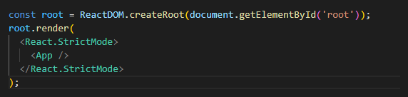

### Ghi chú bài học

React là một library sử dụng JSX để kết nối các file javascript => Single Page Application

Components: chia nhỏ chức năng hệ thống ra thành nhiều phần nhỏ khác nhau.

React sẽ tạo ra một mô hình Virtual-DOM, update trên mô hình DOM đó, sau đó thì mới update trên mô hình DOM thật.

React life cycle: Các hàm có thể sử dụng để can thiệp vào tiến trình khởi tạo component.

Prop: Các thuộc tính của các components, sử dụng để chuyền tham số giữa các components với nhau.

State: là một object lưu trữ giá trị của các thuộc tính bên trong components và chỉ thay đổi các giá trị của một state thì components đó sẽ được render lại.

JSX: 

* Trong React, Element là những mảnh ghép nhỏ nhất của ứng dụng React

* không giống như DOM, React là những đối tượng đơn giản dễ tạo ra

Cú pháp:

React.createElement(type,[props],[...children])

type: thẻ HTML hoặc chính là 1 React component khác

prop là thuộc tính của các element

children là các thuộc tính khác

Vd:

